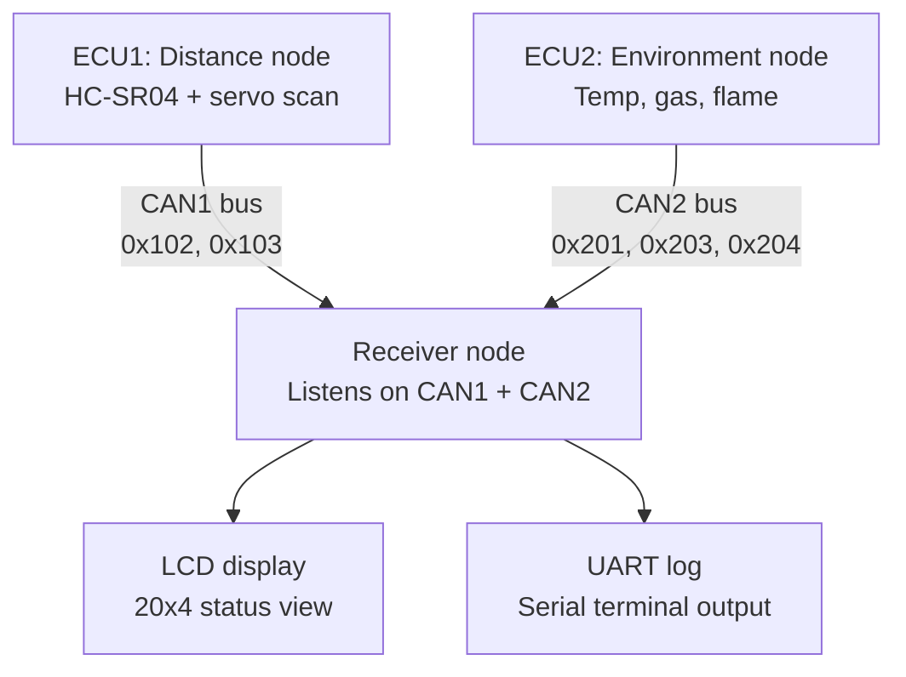

# CAN-Based Smart Ship Monitoring and Collision Warning System

## Overview
A distributed embedded system that monitors ship safety parameters — collision risk,
temperature, gas leaks, and fire — using multiple LPC21xx microcontroller nodes
communicating over CAN (Controller Area Network) buses. Sensor data from independent
nodes is transmitted in real time and consolidated onto a central LCD and UART display,
giving a single at-a-glance view of ship status.

## System Architecture

**ECU1 – Collision Detection Node**
- HC-SR04 ultrasonic sensor, swept across 3 angular positions via servo motor
- Classifies obstacle distance into SAFE / WARNING / DANGER zones
- Local LED indicator + broadcasts distance and status on **CAN1 bus** (IDs `0x102`, `0x103`)

**ECU2 – Environmental Safety Node**
- LM35 temperature sensor (ADC-based)
- Digital gas and flame sensors
- Classifies temperature into Normal / Warning / Alarm bands
- Broadcasts temperature, status, gas, and flame readings on **CAN2 bus** (IDs `0x201`, `0x203`, `0x204`)

**Central Receiver Node**
- Listens on both CAN1 and CAN2 buses
- Decodes incoming frames by message ID
- Displays combined ship status on a 20x4 character LCD
- Logs all readings over UART for serial monitoring

## Flow Diagram

## Communication Protocol
- Two independent CAN buses at 125 kbps: CAN1 (ECU1 ↔ Receiver) and CAN2 (ECU2 ↔ Receiver)
- Message IDs uniquely identify sensor source and data type
- Each node transmits asynchronously; the receiver updates only the relevant
  display field per incoming frame, keeping the LCD always current

## Features
- Real-time collision distance monitoring with proximity alerts
- Fire and gas leak detection with instant warning
- Centralized status display (LCD + UART)
- Modular, dual-CAN-bus architecture — easy to extend with more sensor nodes

## Hardware Used
- LPC2129/LPC2148 microcontrollers (x3)
- HC-SR04 ultrasonic distance sensor
- LM35 temperature sensor
- MQ-series gas sensor
- Flame sensor
- Servo motor (scanning mechanism)
- 20x4 character LCD
- CAN transceivers (e.g. TJA1050 / MCP2551)

## Tech Stack
- Embedded C
- LPC21xx CAN1/CAN2 peripherals (polling-based RX/TX)
- UART (115200 baud) for serial logging
